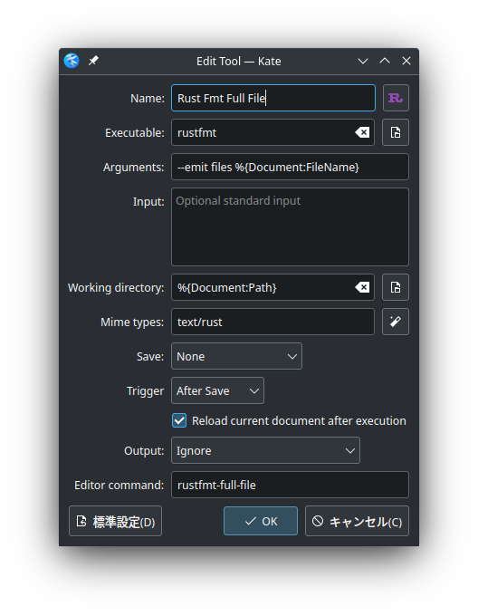

+++
title = "Kate EditorでRustの環境を整えよう"
description = "uooo"
date = 2022-12-09
[extra]
[taxonomies]
categories = ["tech"]
tags = ["ArchLinux","Rust","KDE","Editor"]
+++

# うほっ!いいエディタ...

KateエディタはKDEが開発している軽量で多機能なエディタです。高速に動作してプラグイン等の拡張もできるので
VSCodeに飽きたけど他にいいエディタが無いなぁってときにオススメですよ。

# Install

ArchLinuxを使っているので適宜読み替えて、どうぞ。

エディタのインストール
```bash
$ sudo pacman -S kate
```

rustupからrustをインストールすると後々都合が良い。

```bash
$ sudo pacman -S rustup
$ rustup default stable
```

ツール群はpacmanでインストールすると勝手にパスを通してくれて便利です。
```bash
$ sudo pacman -S rsut-analyzer racer clippy
$ rustup component add rustfmt # こいつはpacmanに無いので個別インスコ
```

# Setup

エディタのセットアップをします。

`(ウィンドウ上部の)設定 → Kateを設定 → External Tools → Add → Add Tool from Defaults → Tools → Rust Fmt Full File `

以下のような設定に変更する



- `Arguments`の`stdout`を`files`に変更
    * rustfmtによるフォーマットをファイルに適用することで、保存時にコードを自動整形してくれる。気が狂うほど便利。

- `Mime types`のテキストボックスの右側にあるボタンを押して、rustで検索をかけたものにチェックをしてOK
    * text/rustになっていたら完了

- `Save` → None
- `Trigger` → After Save
- `Reload current document after execution`にチェックマーク
- `Output` → Ignore

# Happy Hacking!


なんてリッチなエディタなんだ...


