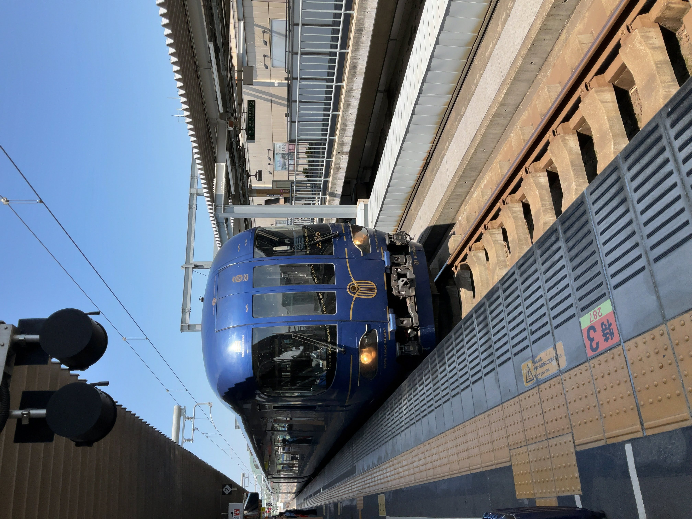

+++
title = "ICOCAで大回り乗車してみた"
description = "合法なので御安心を"
date = 2022-07-12
[extra]
[taxonomies]
categories = ["blog"]
tags = ["鉄道","JR西日本","福知山線","山陰本線"]
+++

# 鉄道オタクは最短ルートを好まない

5月某日、仲のいいフォロワーと京都鉄道博物館に行こうという話になりました。というわけで早速大回り乗車で向かうぞｺﾉﾔﾛｰ!

# 単線なのにそこそこ早くて草

さぁ行こうぜ～～～まずはテキトーに来た電車に乗ります。

223系6000番台が来ましたね。225系のほうが良かったというのは贅沢でしょうか（そこまでアコモに差は無いのですが）。

そうそう、今回の大回り乗車は宝塚->福知山->京都といったルートを通るのですが、実は福知山線の大阪近郊区間は谷川駅で途切れてしまうのです。

「おいおい待ってくれよ、遂にキセル乗車か？？お？？（＾ω＾#）」

っと思った方もいると思いますが、僕は通常の紙のきっぷではなくICOCAを使っているのでこのルートでもOKなんです。詳しくは[こちら](https://www.jr-odekake.net/icoca/info/article.html)を見てほしいのですが簡単に説明すると「ICOCA利用区間内ではどのルートで乗車しても最短経路の運賃が徴収される」というルールが適用されるからです。これを使えば和田山乗り換えで播但線経由の大回りだってできちゃいます yeah

篠山口に着きました。ここで乗り換えします。目の前には2両編成のかわいい電車が止まっております。

なお、福知山線は篠山口以北は単線となっておりますが、すべての駅で列車交換が可能であり、線形も良いので特急・鈍行問わず結構なスピードで走行します（矛盾）。

# おら京都さいくだ～

なんやかんやあって福知山に到着。この駅は特急列車同士の接続が考慮されており、こうのとりやきのさきなどの列車と対面乗り換えする人が
かなり多く見受けられますね 。~~なお普通列車の接続は(~~

2本目の乗車列車は、丹後の海でした。何気に初めての乗車ですねぇ。

車内はﾐﾄｰｶデザインで溢れかえっております。気動車なので窓側席にはダクトが存在。座り心地は、まぁ普通って感じですが、センターアームレストに木の板を貼り付けてるせいで少々狭く感じます。

簡易的なソファのあるフリースペースが存在するので、併用するのが吉ですね。

# 31番乗り場に到着

音楽聴きながら景色見てたら京都に着いてました。
この後は知人と合流して京都鉄道博物館に行く予定...なのですが、知人が遅刻してたので先に博物館に入って結果3時間遅れて合流しました（次のオフ会ホントに大丈夫...?）

こんなゴミ記事を最後までご覧くださってありがとうございました。

 

